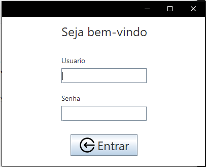
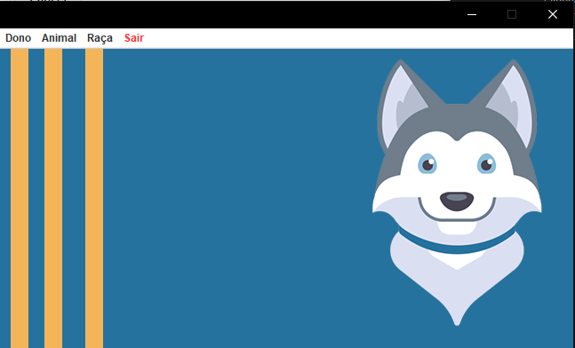

# Projeto-Animal

**Pt-Br**
Este é um projeto desenvolvido no meu terceiro ano do ensino médio, desenvolvido em Java  e MySql.
O projeto basicamente é um gerenciador de adoções de animais.

**En-Us**
This is one project developed in my last high school year, developed in Java and MySql.
This project is one manager of adoptions of animals.

## Preview


## Como instalar?

```
git clone https://github.com/arthurgconti/Projeto-Animal/

inicializar qualquer banco mysql e rodar o script animal-arthur.sql
```
